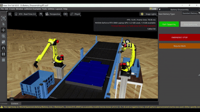
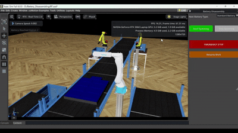
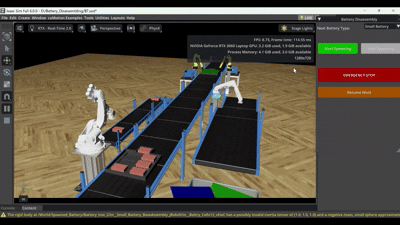
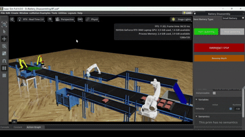

# Automated Battery Disassembly Digital Twin

## Overview
This project simulates a fully automated, physics-accurate robotics simulation designed for EV battery disassembly. It leverages NVIDIA Isaac Sim, integrating CuMotion trajectory planning, custom Python state machines, and vision-based task distribution to control Fanuc, Yaskawa, and Kuka robotic arms in real time.

## System Workflow & Architecture
The system operates in a multi-stage sequential disassembly loop:

### Phase 1: Screw Extraction (Station 1)
1. A virtual camera scans the incoming EV battery to dynamically map fastener coordinates.  
2. The vision processor distributes target data to a dual-arm Fanuc setup based on Y-axis division.  
3. The robots execute multi-step kinematics to remove screws, utilizing scale-based mesh transformations to eliminate 1-frame rendering lag during physical detachment.  

### Phase 2: Cover Removal (Station 2)
4. The conveyor advances the battery, and a Yaskawa robot dynamically identifies the battery type (Standard vs. Small).  
5. The CuMotion planner calculates collision-free trajectories on the fly.  
6. The robot pries off and discards the protective housing into a designated spawn zone while updating the system state.  

### Phase 3: Cell Extraction & Safety Protocols (Station 3)
7. A Kuka robot equipped with a vacuum gripper extracts internal battery cells.  
8. A dynamic FIFO queue clears processed cells to maintain optimal simulation memory limits.  
9. **Emergency Stop Intervention:** If the E-Stop GUI is triggered, all active trajectory executions pause instantly. Upon resume, all robots seamlessly continue from their exact paused coordinates without sequence resets.  

## Technologies & Hardware

### Software Stack
- NVIDIA Isaac Sim (Omniverse)  
- Python (State Machines & Controllers)  
- CuMotion (Graph-Based Motion Planning)  
- USD (Universal Scene Description) API  
- Blender (3D Asset Preparation & Optimization)  

## Project Output

### Station 1: Dual Fanuc Arms

### Station 2: Yaskawa Cover Removal

### Station 3: Kuka Cell Extraction

### Emergency Stop & Resume

## Project Demonstration [Videos]

### Full Simulation Workflow
[Full Project Demonstration](https://youtu.be/H3wEvQaCulg)

## Getting Started (Simulation Logic)

While the full Omniverse USD stage is excluded due to file size constraints, the core control architecture, spawner logic, and vision processing scripts can be run locally by integrating the `Extension/` folder into an Isaac Sim Extension workflow.

## Skills Demonstrated

- Robotics Simulation: Development of multi-station digital twins in NVIDIA Isaac Sim  
- Kinematics & Planning: Implementing CuMotion for real-time, collision-free trajectory generation  
- Simulation Optimization: Engineered matrix scale transformations to bypass topology rebuild lag  
- State Machine Design: Developed Python controllers for robust task queuing and dynamic handoffs  
- 3D Visualization: Integration of optimized CAD assets into virtual environments for engineering validation  
- Problem Solving: Designed asynchronous workflow loops for uninterrupted continuous assembly line operation  

## Key Learning Outcomes

- Mastery of the USD API and Omniverse physics engine mechanics  
- Hands-on experience optimizing runtime rendering and processing loads for complex robotics simulations  
- Understanding of dynamic vision-based task distribution in multi-robot workcells  
- Experience developing stable interrupt routines (E-Stop) within continuous kinematic loops  

## Future Scope
- Integration with Hardware-in-the-Loop (HIL) setups for real-time PLC validation
- ROS2 bridging for external node control
- Automated synthetic data generation for defect detection models

Author
Naveen N G
